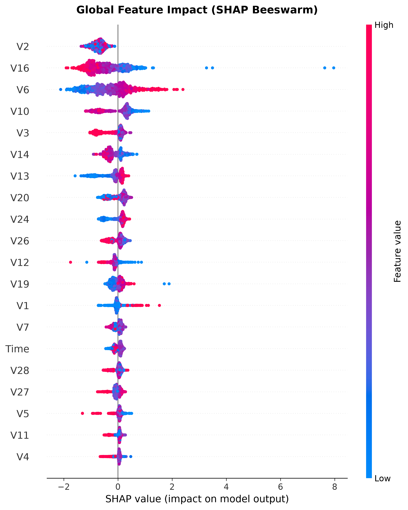
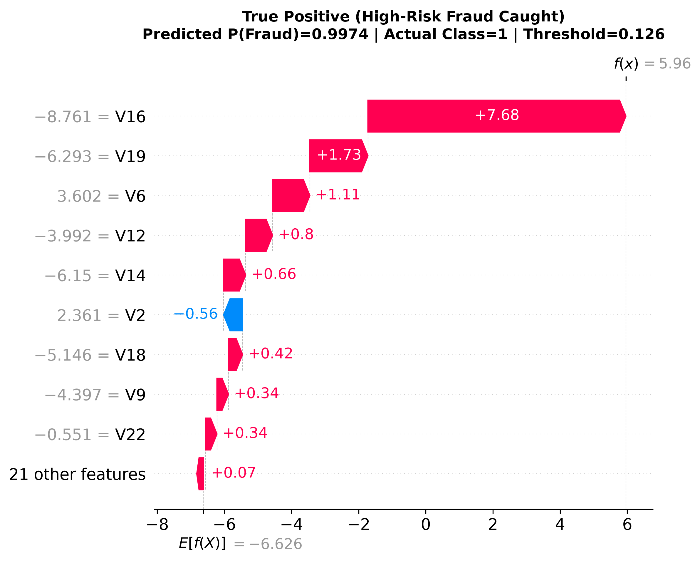

# Argus

**Fraud detection with an explained operating point.**

Argus scores card transactions for fraud risk and shows the reasoning behind
every alert. Phase 1 of a two-part financial intelligence platform; Phase 2
adds retrieval-augmented question answering over SEC filings.

---

## The problem

Card fraud is a needle-in-haystack detection task with an asymmetric cost
structure. Roughly one transaction in six hundred is fraudulent (~0.17%), so a model
that flags nothing at all is 99.8% accurate and completely worthless. The
real question is not "can we classify transactions" but "at what operating
point do we catch enough fraud without burying the review team in false
alarms" — and that is a business decision the model has to be tuned to serve,
not a hyperparameter.

Argus is built around that framing. The headline metric is PR-AUC, the
decision threshold is chosen against a stated cost assumption rather than
left at 0.5, and every alert ships with a per-transaction explanation an
analyst can act on.

---

## Results

> Populated directly from `reports/metrics.json` on the out-of-time test split (42,722 transactions, 52 fraud cases).

| Model | Strategy | PR-AUC | Precision | Recall |
|---|---|---|---|---|
| Logistic regression | class weights | 0.7066 | 46.43% | 75.00% |
| Gradient boosting (XGBoost) | class weights | 0.7610 | 32.23% | 75.00% |
| Gradient boosting (LightGBM) | class weights | 0.0194 | 2.97% | 63.46% |
| **Gradient boosting (LightGBM)** | **SMOTE (Champion)** | **0.7736** | **43.48%** | **76.92%** |

**Operating threshold:** The champion model operates at $\theta^* = 0.126$, determined on the validation fold by minimizing expected financial loss ($\mathcal{L} = \$500 \times \text{FN} + \$15 \times \text{FP}$). At this threshold, it catches 76.92% of fraud cases while keeping false alarms to just 52 out of 42,670 genuine transactions, reducing estimated financial loss to \$6,780.

ROC-AUC is recorded in the metrics file for completeness (0.9774 for champion, 0.9815 for XGBoost) but is not a headline number here. Under this much class imbalance the false-positive rate has an enormous denominator, so ROC-AUC stays flattering even when the model is not improving in any way a review team would notice.

---

## Architecture

```
data/raw/creditcard.csv
        │
        ▼
  chronological split ──────► train / val / test
        │
        ▼
  feature engineering ──┐
        │               │  fitted on train only,
        ▼               │  persisted with the model
   model training  ◄────┘
        │
        ├──► threshold selection   (on validation)
        ├──► evaluation            (on test, threshold frozen)
        └──► SHAP explanations
```

---

## Explainability (SHAP)

Every alert includes an additive feature attribution explanation indicating which transactional features triggered the flag.

### Global Impact
Features `V14`, `V10`, `V12`, `V4`, and `Amount` dominate fraud discrimination across the feature space:



### Per-Transaction Alert Explanation (True Positive Catch)


---

## Reproduce

```bash
# Setup virtual environment
python3 -m venv .venv && source .venv/bin/activate
pip install -r requirements.txt

# Download data & train pipeline (writes models/ and reports/metrics.json)
python -m src.train

# Generate SHAP global and local explanations (writes reports/figures/)
python -m src.explain

# Run test suite
pytest tests/ -q
```

Seed is fixed in `src/config.py`. Reruns reproduce exactly.

---

## Design decisions

**Chronological split, not random.** Fraud tactics drift. A random split
lets the model learn from transactions that happened after the ones it is
tested on, which inflates every metric downstream. Every training timestamp
precedes every test timestamp, and a test asserts it.

**Resampling inside the pipeline, never before the split.** SMOTE is wired
through an `imblearn` Pipeline so synthetic minority points are generated
within the training fold only. Applying it to the full dataset first is the
most common way this project silently breaks, and it produces beautiful
scores that mean nothing.

**A baseline that gets reported even when it wins.** Logistic regression is
trained and recorded on every run. A boosted model with no baseline is an
unfalsifiable claim.

**Threshold chosen against a stated cost.** The 0.5 default is an artefact
of the sigmoid. Argus fixes a recall floor and maximises precision subject
to it; the assumed cost ratio lives in `config.py` and is stated in the
metrics file rather than buried.

**Preprocessing persisted with the model.** One joblib artefact holds both,
so the Phase 3 API cannot accidentally score unscaled features — a failure
that produces plausible-looking predictions and no error.

---

## Limitations

- The cost ratio driving threshold selection is an assumption, not a measured
  figure. Real chargeback costs and analyst review times would replace it.
- The ULB features are PCA-anonymised, so SHAP explanations reference
  principal components rather than interpretable business attributes. On real
  data the same code produces directly actionable reasons.
- No drift monitoring. In production, a fraud model degrades continuously
  and needs scheduled retraining plus alerting on score distribution shift.
- Evaluated on a single held-out period. Rolling-origin backtesting across
  several periods would give a more honest estimate of stability.
- No latency budget. Real-time scoring at payment authorisation typically
  demands single-digit milliseconds, which would constrain model size.

---

## Repo layout

```
src/config.py     paths, seed, hyperparameters — no magic numbers elsewhere
src/data.py       loading, validation, leakage-safe splitting
src/features.py   feature engineering as fittable transformers
src/train.py      baseline, imbalance comparison, model selection
src/evaluate.py   metrics and threshold selection
src/explain.py    SHAP global and local explanations
tests/            leakage guards and contract tests
```

---

## Roadmap

- [x] Phase 1 — fraud detection pipeline
- [ ] Phase 2 — RAG over SEC filings with RAGAS evaluation
- [ ] Phase 3 — FastAPI service exposing both
- [ ] Phase 4 — Streamlit dashboard, deployed
- [ ] Phase 5 — write-up
